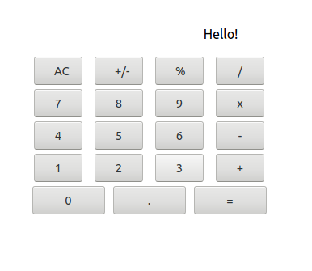

> This project is a React based calculator built as part of the Microverse React module coursework. It avoids using hooks and utilizes minimal css in order to practice state and props available to a react component class

## Project Description

The project is a react calculator app designed to perform basic calculations. By simply inputting a value, an operator, and another value it will return the final calculation of the input given.

#### Features

 -  Offers users easy to read buttons
 -  Utilizes a high contrast graphic display

###### Coming Features
 -  Enhanced syntax inputting
 -  Display of previous calculations until cleared
 -  Enhanced styling

 ## Built With

 -  Atom
 -  Ubuntu
 -  Node.js / npm / yarn
 -  React / React-DOM
 -  React-Create-App
-   JavaScript ES6 / HTML / SCSS

## Live Demo
Try it out [here](https://defoebrand-react-calculator.herokuapp.com)
#### Deployed on: Heroku

## Getting Started Locally

### Prerequisities
To get this project up and running locally, you must have node and npm installed on your computer.

**To get this project set up on your local machine, follow these simple steps:**

**Step 1** 
Navigate to the local folder where you want the repository to be cloned and run
`git clone https://github.com/defoebrand/react-calculator.git`. 

**Step 2** 
Next, run `cd react-calculator`. 

**Step 3** 
Run `yarn start` to begin the server. 

**Step 4** 
Navigate to `http://localhost:3000/` in a browser of your choice to see the application running 

### Testing
This project uses Jest for testing.
> To run tests open a terminal inside the project's root directory and enter `yarn test`

## Authors

👤 **Brandon Defoe**

-   Portfolio: [defoebrand](https://www.defoebrand.com)
-   Github: [@defoebrand](https://github.com/defoebrand)
-   LinkedIn: [@defoebrand](https://www.linkedin.com/in/defoebrand/)
-   Gmail: <mailto:defoe.brand@gmail.com>

## 🤝 Contributing

Our favorite contributions are those that help us improve the project, so please leave an issue or a feature request if you have any suggestions!

Feel free to check the [issues page](https://github.com/defoebrand/react-calculator/issues) to either create an issue or help us out by fixing an existing one.

## Show your support

If you've read this far....give us a ⭐️!

## :clap: Acknowledgements

-   Microverse

## 📝 License

This project is licensed by Microverse